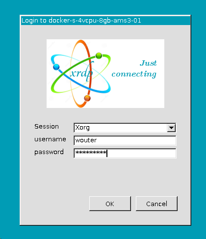
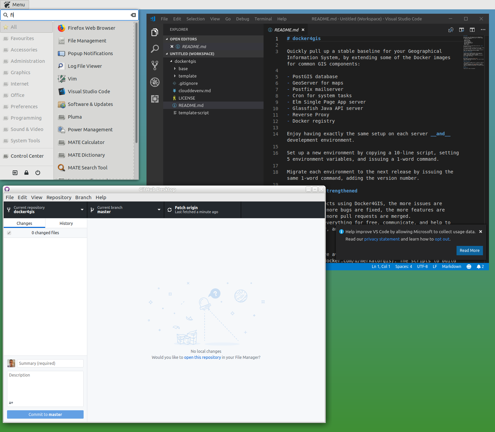

# Development environment on Cloud Virtual Machine

Many standard laptops aren't equipped to run a full Docker development environment; Docker For Windows requires Windows 10 Professional Edition, and you'll need 16 GB of RAM in a laptop. Therefore, a (temporary) setup in the cloud might be an easy way to get things started.

## Setup Cloud VM

Choose your cloud provider. We tried Azure & Digital Ocean; steps for others would be quite similar. Kudos to [Jerry Gamblin](https://github.com/jgamblin) for his [blog on this subject](https://jerrygamblin.com/2016/10/19/ubuntu-remote-desktop-on-digital-ocean/), and to [Brendan Forster](https://github.com/shiftkey/desktop) for his Linux fork of GitHub Desktop.

### Azure

Login on [Microsoft Azure](https://portal.azure.com). New accounts come with a free USD 200,-- credit.

- Choose to add a virtual machine resource
- Image: Ubuntu Server 18.04 LTS
- Size: Standard D2s v3 (2 vcpus, 8 GB memory)
- Authentication type: Password (provide username & password)
- Allow selected ports: HTTPS, SSH, RDP
- Choose a region near you
- Click "Review + create"
- Click "Create"
- Click "Go to resource"
- Click "Serial console"
- In the console, run the following (first 3 commands take like 10 minutes):

``` bash
sudo apt-get update && sudo apt-get dist-upgrade -y
sudo apt-get install --no-install-recommends ubuntu-mate-core ubuntu-mate-desktop -y
sudo apt-get install mate-core mate-desktop-environment mate-notification-daemon xrdp -y
username="$(whoami)"
sudo usermod -aG admin "${username}"
echo mate-session> ~/.xsession
sudo cp "/home/${username}/.xsession" /etc/skel
sudo service xrdp restart
sudo snap install firefox
sudo apt-get install pgadmin3 -y
sudo apt-get install gnome-keyring -y
wget https://github.com/shiftkey/desktop/releases/download/release-1.5.1-linux2/GitHubDesktop-linux-1.5.1-linux2.snap
sudo snap install --dangerous ./GitHubDesktop-linux-1.5.1-linux2.snap
sudo snap connect github-desktop:password-manager-service
sudo snap install --classic vscode
sudo snap install docker
```

### Digital Ocean

Login on [Digital Ocean](https://www.digitalocean.com/). New accounts with 60 day free USD 100,-- credit available throuh [https://try.digitalocean.com/performance/](https://try.digitalocean.com/performance/)

- Choose to create a Droplet, which is a VM
- Image: One Click App `Docker 18.06.1~ce~3 on 18.04`
- Size: Standard Droplet, 8 GB
- Choose a region near you
- Click "Create"
- Check your email for the ip address and password
- If you are on Windows, install [PuTTY](https://www.putty.org/), and open a session to the ip address of your VM
- If you are on Mac or Linux, open a terminal, and type `ssh ipaddressofyourvm`
- In the console, enter `root`, then the password to login (in PuTTY, right-click to paste)
- Enter the password again, to authenticate for creating a new password
- Make up a new password, enter it twice
- Make up a 'normal' user name (a non-root one) and password
- Create the user with `adduser theusernameyouchose`
- Set the username variable by typing: `username=theusernameyouchose`
- Then run the following (first 3 commands take like 10 minutes):
  - (if prompted, choose `install the package maintainer's version`)

``` bash
apt-get update && apt-get dist-upgrade -y
apt-get install --no-install-recommends ubuntu-mate-core ubuntu-mate-desktop -y
apt-get install mate-core mate-desktop-environment mate-notification-daemon xrdp -y
usermod -aG admin "${username}"
usermod -aG sudo "${username}"
su - "${username}"
echo mate-session> ~/.xsession
sudo cp "/home/$(whoami)/.xsession" /etc/skel
sudo service xrdp restart
sudo snap install firefox
sudo apt-get install pgadmin3 -y
sudo apt-get install gnome-keyring -y
wget https://github.com/shiftkey/desktop/releases/download/release-1.5.1-linux2/GitHubDesktop-linux-1.5.1-linux2.snap
sudo snap install --dangerous ./GitHubDesktop-linux-1.5.1-linux2.snap
sudo snap connect github-desktop:password-manager-service
sudo snap install --classic vscode
sudo ufw allow https
sudo ufw allow 3389
```

## Connect with Remote Desktop

### Windows

- WinKey + R, then enter: `mstsc /v:ipaddressofyourvm`




